# Diagrammes UML par Sprint — L'Architecte Claims

---

## Sprint 1 — Authentification & Gestion des Utilisateurs

**Objectif** : Mise en place de l'authentification JWT, inscription, gestion des rôles et profils utilisateurs.

### Diagramme de classes — Sprint 1

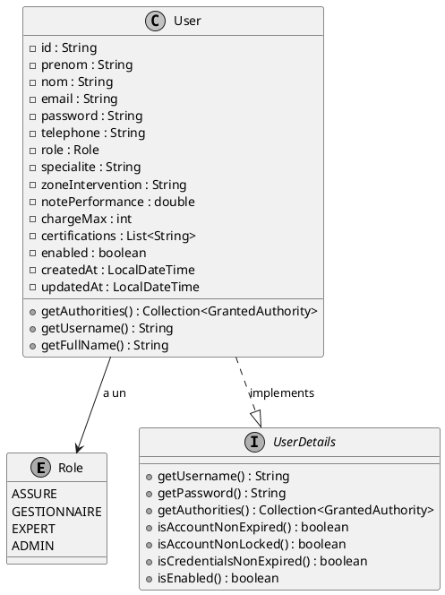

### Diagramme de séquence — Sprint 1

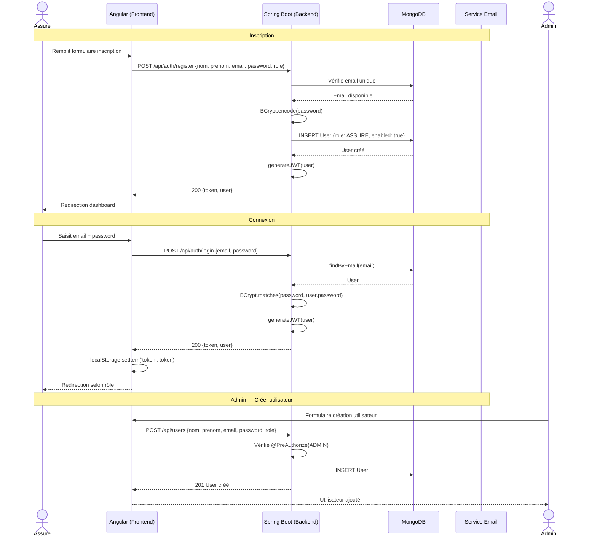

---

## Sprint 2 — Déclaration & Gestion des Sinistres

**Objectif** : Permettre aux assurés de déclarer des sinistres, aux gestionnaires de les qualifier et d'assigner des experts.

### Diagramme de classes — Sprint 2

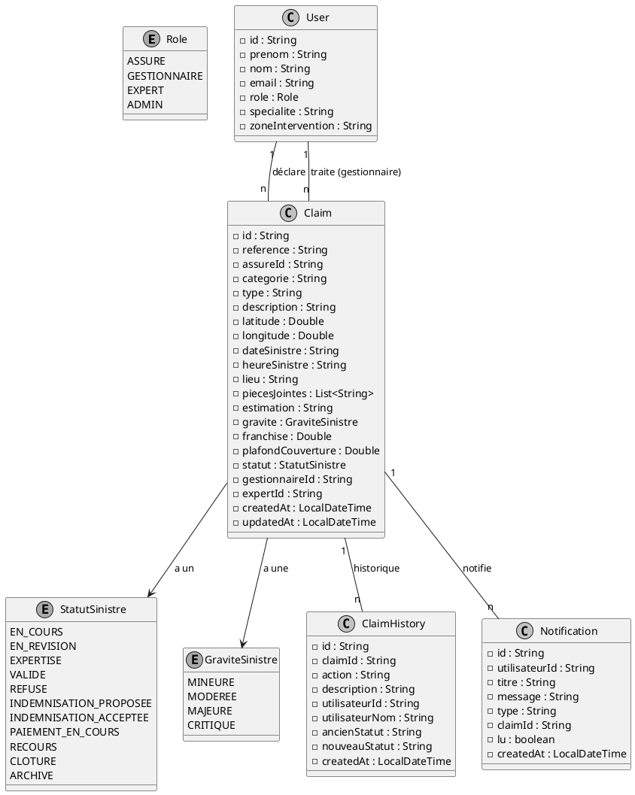

### Diagramme de séquence — Sprint 2

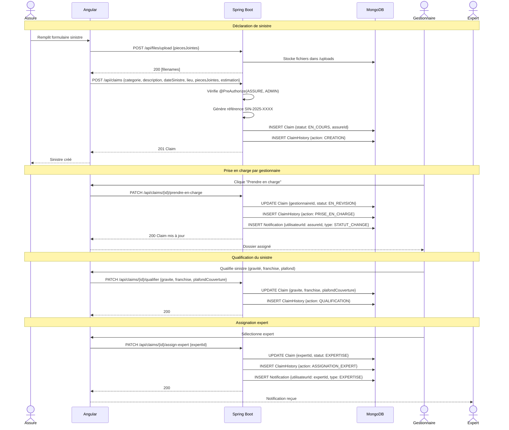

---

## Sprint 3 — Expertise & Analyse IA

**Objectif** : Intégrer l'analyse IA via Ollama et la gestion des rapports d'expertise.

### Diagramme de classes — Sprint 3

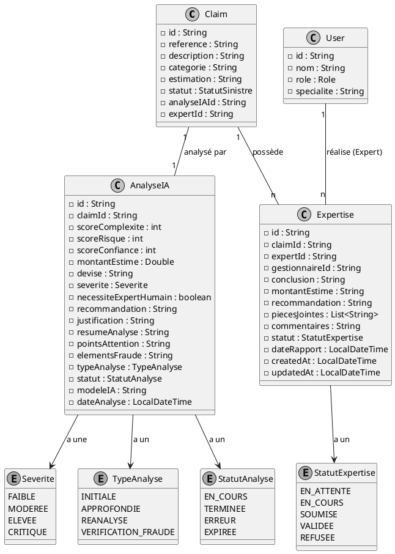

### Diagramme de séquence — Sprint 3

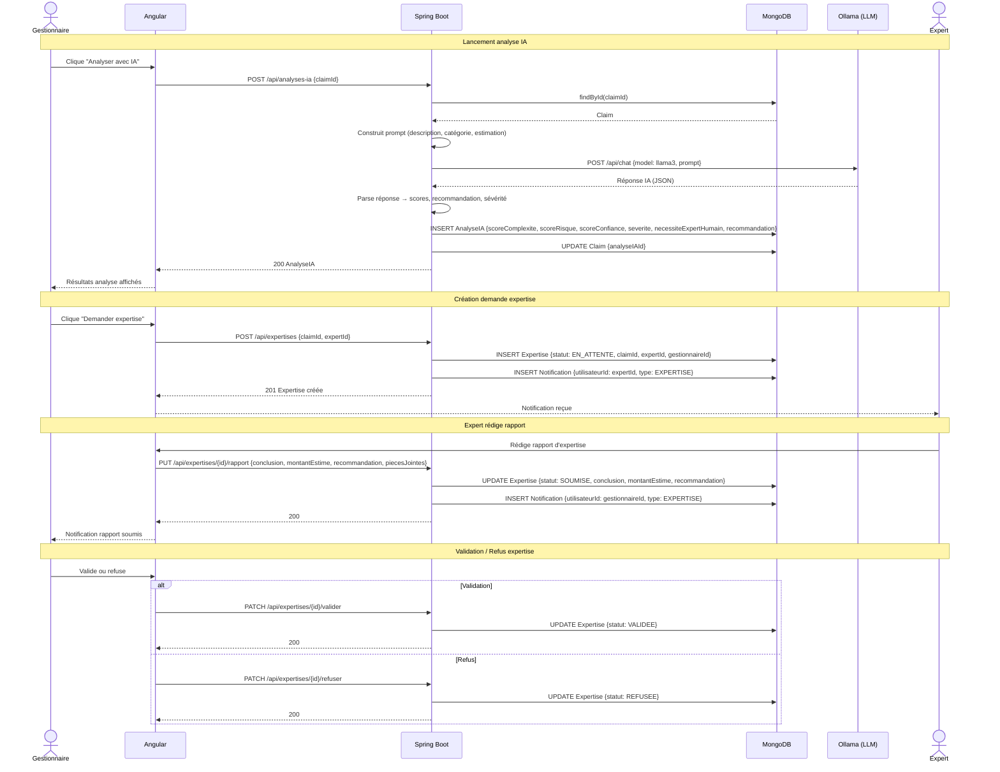

---

## Sprint 4 — Indemnisation & Remboursement (Stripe)

**Objectif** : Calcul d'indemnisation, proposition, validation par l'assuré, et paiement via Stripe.

### Diagramme de classes — Sprint 4

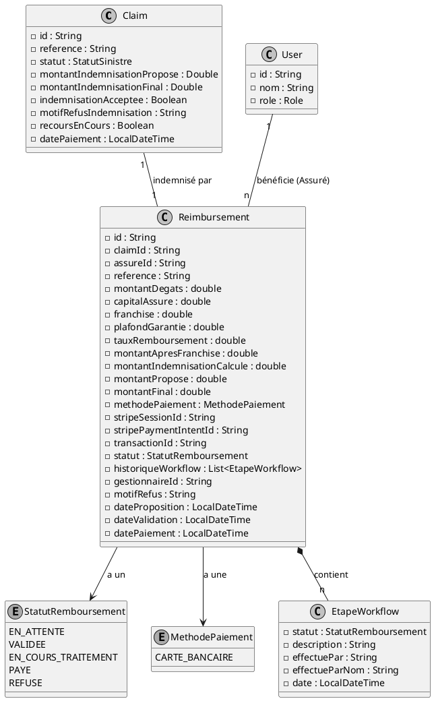

### Diagramme de séquence — Sprint 4

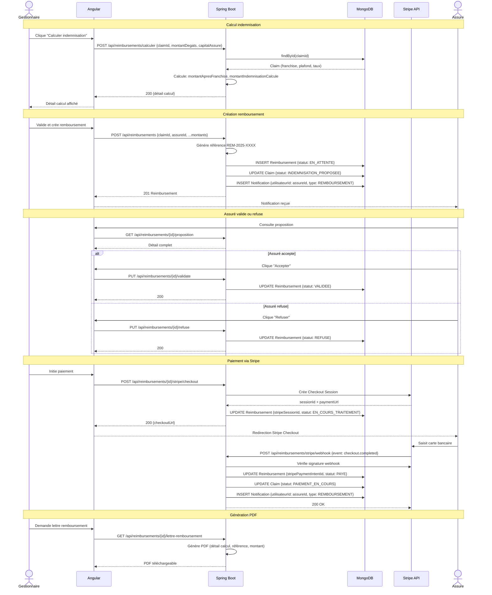

---

## Sprint 5 — Détection de Fraude & Messagerie

**Objectif** : Signalement de fraude, résolution admin, système de messagerie temps réel, notifications.

### Diagramme de classes — Sprint 5

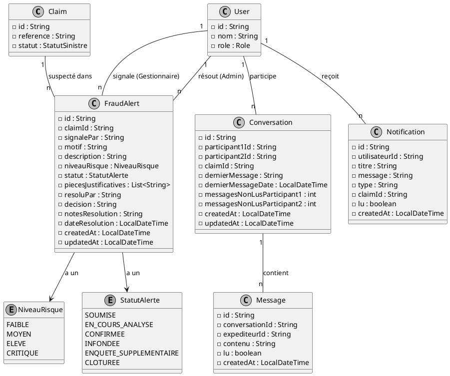

### Diagramme de séquence — Sprint 5

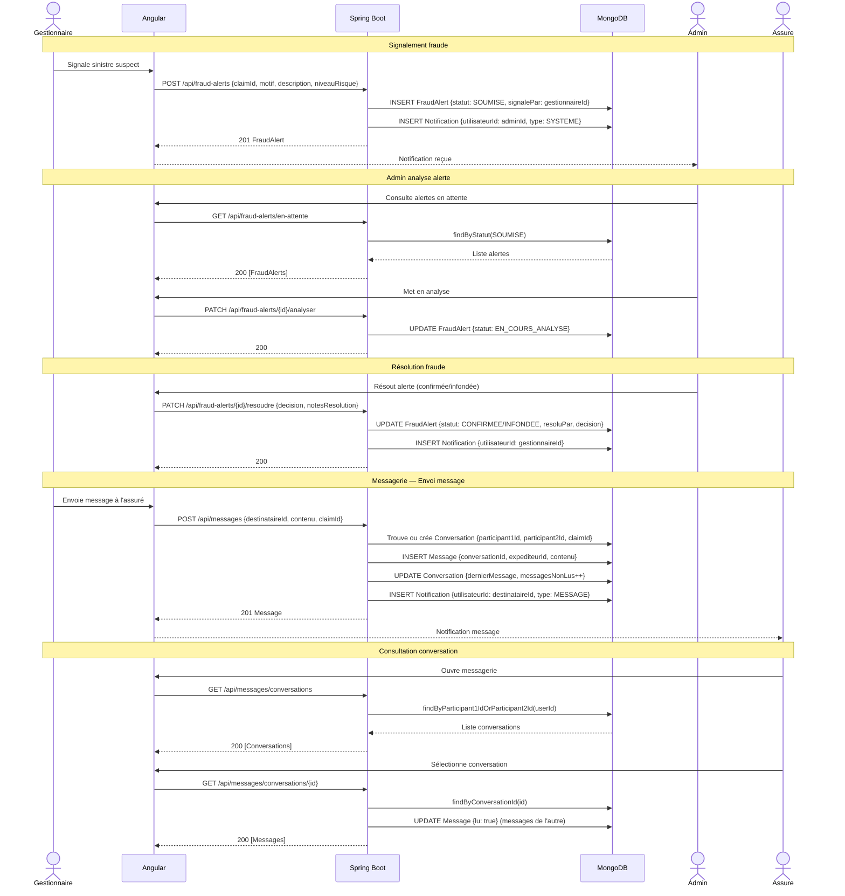

---

## Sprint 6 — Administration, Rapports & Support

**Objectif** : Dashboard admin, analytics, export CSV, tickets support, monitoring IA.

### Diagramme de classes — Sprint 6

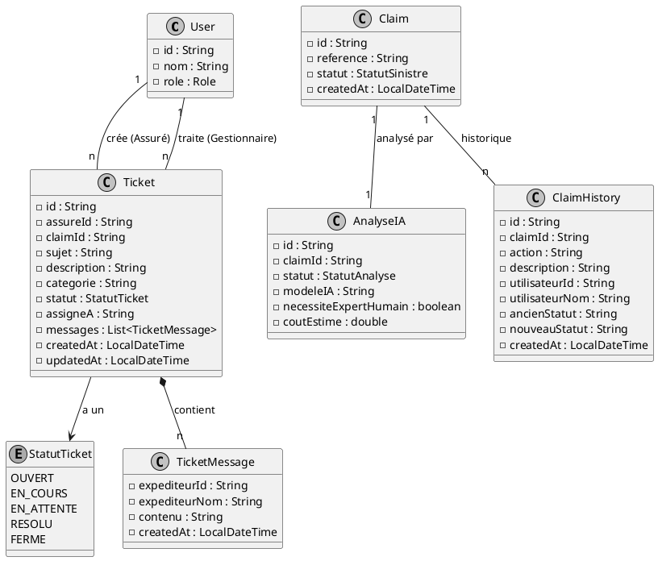

### Diagramme de séquence — Sprint 6

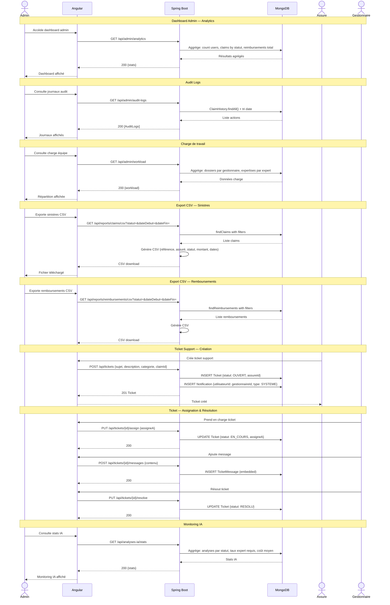
