# Documentation Technique — L'Architecte Claims

## 1. Architecture Générale

| Couche | Technologie | Port |
|--------|-------------|------|
| Frontend | Angular 17+ (standalone), Nginx | 80 |
| Backend | Spring Boot 3, Spring Security + JWT | 8081 |
| Base de données | MongoDB 8 | 27017 |
| IA | Ollama (llama3) | 11434 |
| Paiement | Stripe Checkout | — |

## 2. Modèles de Données

### Role (Enum)
`ASSURE` | `GESTIONNAIRE` | `EXPERT` | `ADMIN`

### User — `users`
| Champ | Type | Description |
|-------|------|-------------|
| id | String | ID MongoDB |
| prenom/nom | String | Nom complet |
| email | String (unique) | Email = login |
| password | String | BCrypt |
| telephone | String | Téléphone |
| role | Role | Rôle utilisateur |
| specialite/zoneIntervention/notePerformance/chargeMax/certifications | — | Champs expert |
| enabled | boolean | Compte actif |
| createdAt/updatedAt | LocalDateTime | Timestamps |

### Claim — `claims`
| Champ | Type | Description |
|-------|------|-------------|
| id | String | ID MongoDB |
| reference | String (unique) | SIN-YYYY-XXXX |
| assureId | FK→User | Assuré déclarant |
| categorie/type | String | Catégorie sinistre |
| latitude/longitude | Double | Géolocalisation |
| description/dateSinistre/heureSinistre/lieu | — | Infos incident |
| piecesJointes | List<String> | Fichiers joints |
| estimation | String | Estimation dégâts |
| notesInternes | String | Notes équipe |
| gravite | Enum | MINEURE/MODEREE/MAJEURE/CRITIQUE |
| couvertureContractuelle/franchise/plafondCouverture | — | Qualification |
| montantIndemnisationPropose/montantIndemnisationFinal | Double | Indemnisation |
| indemnisationAcceptee/recoursEnCours | Boolean | Statut indemnisation |
| statut | StatutSinistre | 11 statuts (voir ci-dessous) |
| gestionnaireId/expertId | FK→User | Assignations |
| analyseIAId | FK→AnalyseIA | Analyse IA |

**StatutSinistre**: EN_COURS → EN_REVISION → EXPERTISE → VALIDE/REFUSE → INDEMNISATION_PROPOSEE → INDEMNISATION_ACCEPTEE → PAIEMENT_EN_COURS → CLOTURE / RECOURS / ARCHIVE

### ClaimHistory — `claim_history`
| Champ | Type | Description |
|-------|------|-------------|
| id | String | ID MongoDB |
| claimId | FK→Claim | Sinistre concerné |
| action | String | Type d'action |
| description | String | Description action |
| utilisateurId/utilisateurNom/utilisateurRole | — | Acteur |
| ancienStatut/nouveauStatut | String | Changement statut |
| createdAt | LocalDateTime | Timestamp |

### Expertise — `expertises`
| Champ | Type | Description |
|-------|------|-------------|
| id | String | ID MongoDB |
| claimId | FK→Claim | Sinistre |
| expertId | FK→User | Expert |
| gestionnaireId | FK→User | Gestionnaire |
| conclusion/montantEstime/recommandation | — | Résultat expertise |
| piecesJointes/commentaires | — | Justifications |
| statut | StatutExpertise | EN_ATTENTE/EN_COURS/SOUMISE/VALIDEE/REFUSEE |
| dateRapport | LocalDateTime | Date rapport |

### AnalyseIA — `analyses_ia`
| Champ | Type | Description |
|-------|------|-------------|
| id | String | ID MongoDB |
| claimId | FK→Claim | Sinistre analysé |
| scoreComplexite/scoreRisque/scoreConfiance | int (0-100) | Scores |
| montantEstime/devise | — | Estimation IA |
| severite | Enum | FAIBLE/MODEREE/ELEVEE/CRITIQUE |
| categorieDetectee/motsCles | — | Classification |
| necessiteExpertHumain/recommandation/justification | — | Recommandation |
| resumeAnalyse/pointsAttention/elementsFraude | — | Analyse détaillée |
| typeAnalyse | Enum | INITIALE/APPROFONDIE/REANALYSE/VERIFICATION_FRAUDE |
| statut | Enum | EN_COURS/TERMINEE/ERREUR/EXPIREE |
| modeleIA/tokensUtilises/coutEstime | — | Métadonnées IA |

### FraudAlert — `fraud_alerts`
| Champ | Type | Description |
|-------|------|-------------|
| id | String | ID MongoDB |
| claimId | FK→Claim | Sinistre suspect |
| signalePar | FK→User | Gestionnaire signalant |
| motif/description | String | Motif signalement |
| niveauRisque | Enum | FAIBLE/MOYEN/ELEVE/CRITIQUE |
| statut | StatutAlerte | SOUMISE→EN_COURS_ANALYSE→CONFIRMEE/INFONDEE/CLOTUREE |
| piecesJustificatives | List<String> | Pièces |
| resoluPar/decision/notesResolution/dateResolution | — | Résolution admin |

### Reimbursement — `reimbursements`
| Champ | Type | Description |
|-------|------|-------------|
| id | String | ID MongoDB |
| claimId | FK→Claim | Sinistre |
| assureId | FK→User | Bénéficiaire |
| reference | String | REM-YYYY-XXXX |
| montantDegats/capitalAssure/franchise/plafondGarantie/tauxRemboursement | — | Calcul |
| montantApresFranchise/montantIndemnisationCalcule | — | Résultat calcul |
| montantPropose/montantFinal | Double | Montants |
| stripeSessionId/stripePaymentIntentId/transactionId | — | Stripe |
| methodePaiement | Enum | CARTE_BANCAIRE |
| statut | Enum | EN_ATTENTE/VALIDEE/EN_COURS_TRAITEMENT/PAYE/REFUSE |
| historiqueWorkflow | Embedded[] | Traçabilité |
| gestionnaireId/motifRefus/notes | — | Gestion |

### Conversation — `conversations`
| Champ | Type | Description |
|-------|------|-------------|
| id | String | ID MongoDB |
| participant1Id | FK→User | Gestionnaire |
| participant2Id | FK→User | Assuré |
| claimId | FK→Claim (optionnel) | Sinistre lié |
| dernierMessage/dernierMessageDate | — | Dernier message |
| messagesNonLusParticipant1/messagesNonLusParticipant2 | int | Non lus |

### Message — `messages`
| Champ | Type | Description |
|-------|------|-------------|
| id | String | ID MongoDB |
| conversationId | FK→Conversation | Conversation |
| expediteurId | FK→User | Expéditeur |
| contenu | String | Contenu |
| lu | boolean | Lu |

### Notification — `notifications`
| Champ | Type | Description |
|-------|------|-------------|
| id | String | ID MongoDB |
| utilisateurId | FK→User | Destinataire |
| titre/message | String | Contenu |
| type | String | STATUT_CHANGE/EXPERTISE/REMBOURSEMENT/MESSAGE/SYSTEME |
| claimId | FK→Claim (optionnel) | Sinistre lié |
| lu | boolean | Lu |

### Ticket — `tickets`
| Champ | Type | Description |
|-------|------|-------------|
| id | String | ID MongoDB |
| assureId | FK→User | Assuré créateur |
| claimId | FK→Claim (optionnel) | Sinistre lié |
| sujet/description/categorie | String | Infos ticket |
| statut | Enum | OUVERT/EN_COURS/EN_ATTENTE/RESOLU/FERME |
| assigneA | FK→User | Gestionnaire assigné |
| messages | Embedded TicketMessage[] | Messages du ticket |

---

## 3. Relations entre Modèles

- **User → Claim**: 1:N (assureId, gestionnaireId, expertId)
- **User → Expertise**: 1:N (expertId, gestionnaireId)
- **User → Notification**: 1:N (utilisateurId)
- **User → Conversation**: 1:N (participant1Id, participant2Id)
- **User → Message**: 1:N (expediteurId)
- **User → Ticket**: 1:N (assureId)
- **User → Reimbursement**: 1:N (assureId)
- **User → FraudAlert**: 1:N (signalePar, resoluPar)
- **Claim → ClaimHistory**: 1:N (claimId)
- **Claim → AnalyseIA**: 1:1 (analyseIAId / claimId)
- **Claim → Expertise**: 1:N (claimId)
- **Claim → Reimbursement**: 1:N (claimId)
- **Claim → FraudAlert**: 1:1 (claimId)
- **Claim → Conversation**: 0:1 (claimId)
- **Claim → Ticket**: 0:1 (claimId)
- **Conversation → Message**: 1:N (conversationId)
- **Ticket → TicketMessage**: 1:N (embedded)
- **Reimbursement → EtapeWorkflow**: 1:N (embedded)

---

## 4. API REST — Endpoints

### `/api/auth`
| Méthode | Route | Rôle | Description |
|---------|-------|------|-------------|
| POST | /login | Public | Connexion → JWT |
| POST | /register | Public | Inscription |

### `/api/claims`
| Méthode | Route | Rôle | Description |
|---------|-------|------|-------------|
| POST | / | ASSURE, ADMIN | Créer sinistre |
| GET | /mes-sinistres | ASSURE | Sinistres de l'assuré |
| GET | /{id} | Tous | Détail sinistre |
| GET | / | GESTIONNAIRE, EXPERT, ADMIN | Tous sinistres |
| PATCH | /{id}/statut | GESTIONNAIRE, ADMIN | Changer statut |
| PATCH | /{id}/prendre-en-charge | GESTIONNAIRE | Prendre en charge |
| PATCH | /{id}/assign-gestionnaire | ADMIN | Assigner gestionnaire |
| PATCH | /{id}/assign-expert | GESTIONNAIRE, ADMIN | Assigner expert |
| PATCH | /{id}/auto-assign-expert | GESTIONNAIRE, ADMIN | Auto-assignation |
| GET | /dossiers-assignes | GESTIONNAIRE | Dossiers assignés |
| GET | /dashboard-stats | GESTIONNAIRE | Stats dashboard |
| GET | /mes-dossiers | EXPERT | Dossiers expert |
| GET | /expert-dashboard-stats | EXPERT | Stats expert |
| GET | /experts | GESTIONNAIRE, ADMIN | Liste experts |
| GET | /gestionnaires | GESTIONNAIRE, ADMIN | Liste gestionnaires |
| PATCH | /{id}/transferer-gestionnaire | GESTIONNAIRE | Transférer dossier |
| POST | /{id}/demander-documents | GESTIONNAIRE | Demander documents |
| PATCH | /{id}/notes-internes | GESTIONNAIRE, ADMIN | Notes internes |
| PATCH | /{id}/archiver | GESTIONNAIRE, ADMIN | Archiver |
| PATCH | /{id}/qualifier | GESTIONNAIRE, ADMIN | Qualifier sinistre |
| PATCH | /{id}/proposer-indemnisation | GESTIONNAIRE, ADMIN | Proposer indemnisation |
| PATCH | /{id}/accepter-indemnisation | ASSURE+ | Accepter |
| PATCH | /{id}/refuser-indemnisation | ASSURE+ | Refuser |
| PATCH | /{id}/initier-paiement | GESTIONNAIRE, ADMIN | Initier paiement |
| PATCH | /{id}/confirmer-paiement | GESTIONNAIRE, ADMIN | Confirmer paiement |
| PATCH | /{id}/declarer-recours | GESTIONNAIRE, ADMIN | Déclarer recours |
| POST | /migrate-expertises | ADMIN | Migration |

### `/api/claims/{claimId}/history`
| GET | / | Authentifié | Historique sinistre |

### `/api/expertises`
| Méthode | Route | Rôle | Description |
|---------|-------|------|-------------|
| POST | / | GESTIONNAIRE, ADMIN | Créer expertise |
| GET | /{id} | GESTIONNAIRE, EXPERT, ADMIN | Détail |
| GET | /claim/{claimId} | GESTIONNAIRE, EXPERT, ADMIN | Par sinistre |
| GET | /mes-expertises | EXPERT | Mes expertises |
| GET | /gestionnaire | GESTIONNAIRE | Expertises gestionnaire |
| GET | / | ADMIN | Toutes |
| PUT | /{id}/rapport | EXPERT | Soumettre rapport |
| PUT | /{id}/brouillon | EXPERT | Sauver brouillon |
| PATCH | /{id}/valider | GESTIONNAIRE, ADMIN | Valider |
| PATCH | /{id}/refuser | GESTIONNAIRE, ADMIN | Refuser |

### `/api/analyses-ia`
| Méthode | Route | Rôle | Description |
|---------|-------|------|-------------|
| POST | / | GESTIONNAIRE, ADMIN | Lancer analyse |
| GET | /claim/{claimId} | Tous | Analyse sinistre |
| GET | /expert-requis | GESTIONNAIRE, ADMIN | Expert requis |
| GET | / | ADMIN | Toutes analyses |
| GET | /stats | GESTIONNAIRE, ADMIN | Stats IA |

### `/api/fraud-alerts`
| Méthode | Route | Rôle | Description |
|---------|-------|------|-------------|
| POST | / | GESTIONNAIRE | Créer signalement |
| GET | /mes-signalements | GESTIONNAIRE | Mes signalements |
| GET | /{id} | GESTIONNAIRE, ADMIN | Détail |
| GET | / | ADMIN | Toutes alertes |
| GET | /en-attente | ADMIN | En attente |
| PATCH | /{id}/analyser | ADMIN | Mettre en analyse |
| PATCH | /{id}/resoudre | ADMIN | Résoudre |
| GET | /stats | ADMIN | Stats fraude |

### `/api/reimbursements`
| Méthode | Route | Rôle | Description |
|---------|-------|------|-------------|
| POST | /calculer | GESTIONNAIRE, ADMIN | Calculer indemnisation |
| POST | / | GESTIONNAIRE, ADMIN | Créer remboursement |
| GET | /{id}/proposition | Authentifié | Proposition |
| GET | /my | ASSURE | Mes remboursements |
| GET | / | GESTIONNAIRE, ADMIN | Tous |
| GET | /{id} | Authentifié | Détail |
| GET | /statut/{statut} | GESTIONNAIRE, ADMIN | Par statut |
| GET | /stats | GESTIONNAIRE, ADMIN | Stats |
| PUT | /{id}/validate | ASSURE | Valider |
| PUT | /{id}/refuse | ASSURE | Refuser |
| POST | /{id}/stripe/checkout | GESTIONNAIRE, ADMIN | Session Stripe |
| GET | /{id}/stripe/verify | Authentifié | Vérifier Stripe |
| POST | /stripe/webhook | Public | Webhook Stripe |
| PUT | /{id}/process | GESTIONNAIRE, ADMIN | Traiter |
| PUT | /{id}/pay | GESTIONNAIRE, ADMIN | Confirmer paiement |
| GET | /{id}/lettre-remboursement | GESTIONNAIRE, ADMIN | PDF remboursement |
| POST | /{id}/lettre-rejet | GESTIONNAIRE, ADMIN | PDF rejet |

### `/api/messages`
| POST | / | Tous | Envoyer message |
| GET | /conversations | Tous | Mes conversations |
| GET | /conversations/{id} | Tous | Messages conversation |

### `/api/notifications`
| GET | / | Authentifié | Mes notifications |
| GET | /unread | Authentifié | Non lues |
| GET | /unread-count | Authentifié | Compteur |
| PUT | /{id}/read | Authentifié | Marquer lue |
| PUT | /read-all | Authentifié | Tout marquer lu |

### `/api/tickets`
| POST | / | ASSURE | Créer ticket |
| GET | /my | ASSURE | Mes tickets |
| GET | / | GESTIONNAIRE, ADMIN | Tous tickets |
| GET | /{id} | Authentifié | Détail |
| POST | /{id}/messages | Authentifié | Ajouter message |
| PUT | /{id}/assign | GESTIONNAIRE, ADMIN | Assigner |
| PUT | /{id}/resolve | GESTIONNAIRE, ADMIN | Résoudre |
| PUT | /{id}/close | GESTIONNAIRE, ADMIN | Fermer |

### `/api/users`
| GET | /me | Authentifié | Mon profil |
| PUT | /me | Authentifié | Modifier profil |
| PUT | /me/password | Authentifié | Changer mot de passe |
| PATCH | /{id}/toggle-status | GESTIONNAIRE, ADMIN | Activer/désactiver |
| GET | / | ADMIN | Tous utilisateurs |
| GET | /role/{role} | ADMIN | Par rôle |
| POST | / | ADMIN | Créer utilisateur |
| PATCH | /{id}/role | ADMIN | Changer rôle |
| DELETE | /{id} | ADMIN | Supprimer |
| GET | /search | ADMIN | Rechercher |
| GET | /admin-stats | ADMIN | Stats admin |

### `/api/admin`
| GET | /analytics | ADMIN | Stats analytics |
| GET | /audit-logs | ADMIN | Journaux audit |
| GET | /workload | ADMIN | Charge travail |

### `/api/files`
| POST | /upload | Authentifié | Upload fichiers |
| POST | /upload-single | Authentifié | Upload un fichier |
| DELETE | /{filename} | Authentifié | Supprimer fichier |
| GET | /download/{filename} | Authentifié | Télécharger fichier |

### `/api/reports`
| GET | /claims/csv | GESTIONNAIRE, ADMIN | Export CSV sinistres |
| GET | /reimbursements/csv | GESTIONNAIRE, ADMIN | Export CSV remboursements |

---

## 5. Services Backend — Responsabilités

| Service | Responsabilité |
|---------|---------------|
| AuthService | Login, inscription, génération JWT |
| UserService | CRUD utilisateurs, profil, changement mot de passe, stats admin |
| ClaimService | CRUD sinistres, workflow statut, qualification, indemnisation, assignation, archivage |
| ClaimHistoryService | Historique des actions sur sinistres |
| ExpertiseService | CRUD expertises, soumission rapport, validation/refus, brouillons |
| AnalyseIAService | Analyse IA via Ollama, scores, recommandations, stats |
| FraudAlertService | Signalement fraude, résolution admin, stats fraude |
| ReimbursementService | Calcul indemnisation, workflow remboursement, validation/refus assuré |
| StripeService | Sessions Stripe Checkout, vérification paiement, webhook |
| PdfGenerationService | Génération PDF lettres de remboursement et de rejet |
| MessageService | Messagerie, conversations, envoi de messages |
| NotificationService | Notifications in-app, marquage lu, compteur non lues |
| TicketService | Tickets support, messages, assignation, résolution |
| FileStorageService | Upload/download/suppression de fichiers |
| AdminService | Analytics, audit logs, charge de travail |
| CustomUserDetailsService | Implémentation UserDetailsService pour Spring Security |

---

## 6. Architecture Frontend

### 6.1 Structure des modules

```
src/app/
├── auth/            → Connexion, Inscription
├── assure/          → Espace Assuré (layout + 9 pages)
├── gestionnaire/    → Espace Gestionnaire (layout + 11 pages)
├── expert/          → Espace Expert (layout + 5 pages)
├── admin/           → Espace Admin (layout + 7 pages)
├── core/            → 14 services + auth guard + interceptor
└── shared/          → Composants partagés (notification-bell, helpers)
```

### 6.2 Routage par rôle

**Assuré** `/assure`:
- tableau-de-bord, mes-sinistres, declarer-sinistre, detail-sinistre/:id
- remboursements, messagerie, faq, support, profil

**Gestionnaire** `/gestionnaire`:
- tableau-de-bord, dossiers-assignes, tous-sinistres, messagerie
- remboursements, support, analyse-ia, approbation, rapports
- signalement-fraude, profil

**Expert** `/expert`:
- tableau-de-bord, dossiers, rapport-expertise, messagerie, profil

**Admin** `/admin`:
- tableau-de-bord, utilisateurs, experts, rapports-analytics
- monitoring-ia, gestion-technique, surveillance-fraude

### 6.3 Services Frontend (core/)

| Service | Rôle |
|---------|------|
| auth.service | Auth HTTP + stockage JWT |
| auth.guard | Protection routes par rôle |
| auth.interceptor | Injection JWT dans headers HTTP |
| claim.service | Appels API sinistres |
| expertise.service | Appels API expertises |
| analyse-ia.service | Appels API analyses IA |
| fraud-alert.service | Appels API fraude |
| reimbursement.service | Appels API remboursements |
| message.service | Appels API messagerie |
| notification.service | Appels API notifications |
| ticket.service | Appels API tickets |
| user.service | Appels API utilisateurs |
| admin.service | Appels API admin |
| file.service | Upload/download fichiers |

---

## 7. Sécurité

- **Authentification**: JWT (24h expiration), BCrypt password encoding
- **Autorisation**: Spring Security + @PreAuthorize par rôle
- **CORS**: Autorisé pour localhost:4200 et localhost
- **Filtre**: JwtAuthFilter avant UsernamePasswordAuthenticationFilter
- **Endpoints publics**: /api/auth/**, /stripe/webhook, /error

---

## 8. Diagrammes

### 8.1 Diagramme de Classes UML (Mermaid)

```mermaid
classDiagram
    class User {
        +String id prenom nom email password telephone
        +Role role
        +String specialite zoneIntervention
        +double notePerformance
        +int chargeMax
        +boolean enabled
    }
    class Role { <<enumeration>> ASSURE GESTIONNAIRE EXPERT ADMIN }
    class Claim {
        +String id reference assureId categorie type
        +String description dateSinistre lieu
        +GraviteSinistre gravite
        +StatutSinistre statut
        +Double montantIndemnisationPropose montantIndemnisationFinal
        +String gestionnaireId expertId analyseIAId
    }
    class StatutSinistre { <<enumeration>> EN_COURS EN_REVISION EXPERTISE VALIDE REFUSE INDEMNISATION_PROPOSEE INDEMNISATION_ACCEPTEE PAIEMENT_EN_COURS RECOURS CLOTURE ARCHIVE }
    class ClaimHistory { +String id claimId action description utilisateurId ancienStatut nouveauStatut }
    class Expertise { +String id claimId expertId gestionnaireId conclusion montantEstime recommandation +StatutExpertise statut }
    class StatutExpertise { <<enumeration>> EN_ATTENTE EN_COURS SOUMISE VALIDEE REFUSEE }
    class AnalyseIA { +String id claimId +int scoreComplexite scoreRisque scoreConfiance +Severite severite +boolean necessiteExpertHumain +String recommandation resumeAnalyse elementsFraude }
    class FraudAlert { +String id claimId signalePar motif +NiveauRisque niveauRisque +StatutAlerte statut +String resoluPar decision }
    class Reimbursement { +String id claimId assureId reference +double montantDegats franchise tauxRemboursement montantIndemnisationCalcule montantPropose montantFinal +StatutRemboursement statut +String stripeSessionId }
    class Conversation { +String id participant1Id participant2Id claimId dernierMessage }
    class Message { +String id conversationId expediteurId contenu +boolean lu }
    class Notification { +String id utilisateurId titre message type claimId +boolean lu }
    class Ticket { +String id assureId claimId sujet description +StatutTicket statut +String assigneA }

    User "1" --> "*" Claim : assureId/gestionnaireId/expertId
    User "1" --> "*" Expertise : expertId/gestionnaireId
    User "1" --> "*" Notification : utilisateurId
    User "1" --> "*" Conversation : participant
    User "1" --> "*" Message : expediteurId
    User "1" --> "*" Ticket : assureId
    User "1" --> "*" Reimbursement : assureId
    User "1" --> "*" FraudAlert : signalePar/resoluPar
    Claim "1" --> "*" ClaimHistory : claimId
    Claim "1" --> "0..1" AnalyseIA : analyseIAId
    Claim "1" --> "*" Expertise : claimId
    Claim "1" --> "*" Reimbursement : claimId
    Claim "1" --> "0..1" FraudAlert : claimId
    Claim "1" --> "0..1" Conversation : claimId
    Conversation "1" --> "*" Message : conversationId
    Claim --> StatutSinistre
    User --> Role
```

### 8.2 Diagramme ER — Base de Données (Mermaid)

```mermaid
erDiagram
    users {
        String id PK
        String prenom nom
        String email UK
        String password
        String telephone
        String role
        String specialite
        String zoneIntervention
        double notePerformance
        boolean enabled
    }
    claims {
        String id PK
        String reference UK
        String assureId FK
        String categorie type
        String description
        String dateSinistre lieu
        String gravite
        String statut
        Double montantIndemnisationPropose
        Double montantIndemnisationFinal
        String gestionnaireId FK
        String expertId FK
        String analyseIAId FK
    }
    claim_history {
        String id PK
        String claimId FK
        String action
        String utilisateurId FK
        String ancienStatut nouveauStatut
    }
    expertises {
        String id PK
        String claimId FK
        String expertId FK
        String gestionnaireId FK
        String conclusion montantEstime recommandation
        String statut
    }
    analyses_ia {
        String id PK
        String claimId FK
        int scoreComplexite scoreRisque scoreConfiance
        Double montantEstime
        String severite
        boolean necessiteExpertHumain
        String recommandation resumeAnalyse
        String typeAnalyse statut
    }
    fraud_alerts {
        String id PK
        String claimId FK
        String signalePar FK
        String motif description
        String niveauRisque statut
        String resoluPar FK
        String decision
    }
    reimbursements {
        String id PK
        String claimId FK
        String assureId FK
        String reference UK
        double montantDegats capitalAssure franchise
        double tauxRemboursement montantIndemnisationCalcule
        double montantPropose montantFinal
        String stripeSessionId
        String statut
    }
    conversations {
        String id PK
        String participant1Id FK
        String participant2Id FK
        String claimId FK
        String dernierMessage
    }
    messages {
        String id PK
        String conversationId FK
        String expediteurId FK
        String contenu
        boolean lu
    }
    notifications {
        String id PK
        String utilisateurId FK
        String titre message type
        String claimId FK
        boolean lu
    }
    tickets {
        String id PK
        String assureId FK
        String claimId FK
        String sujet description categorie
        String statut
        String assigneA FK
    }

    users ||--o{ claims : assureId
    users ||--o{ claims : gestionnaireId
    users ||--o{ claims : expertId
    users ||--o{ expertises : expertId
    users ||--o{ expertises : gestionnaireId
    users ||--o{ notifications : utilisateurId
    users ||--o{ conversations : participant
    users ||--o{ messages : expediteurId
    users ||--o{ tickets : assureId
    users ||--o{ reimbursements : assureId
    users ||--o{ fraud_alerts : signalePar
    claims ||--o{ claim_history : claimId
    claims ||--o| analyses_ia : analyseIAId
    claims ||--o{ expertises : claimId
    claims ||--o{ reimbursements : claimId
    claims ||--o| fraud_alerts : claimId
    claims ||--o| conversations : claimId
    conversations ||--o{ messages : conversationId
```

### 8.3 Diagramme d'Architecture Système (Mermaid)

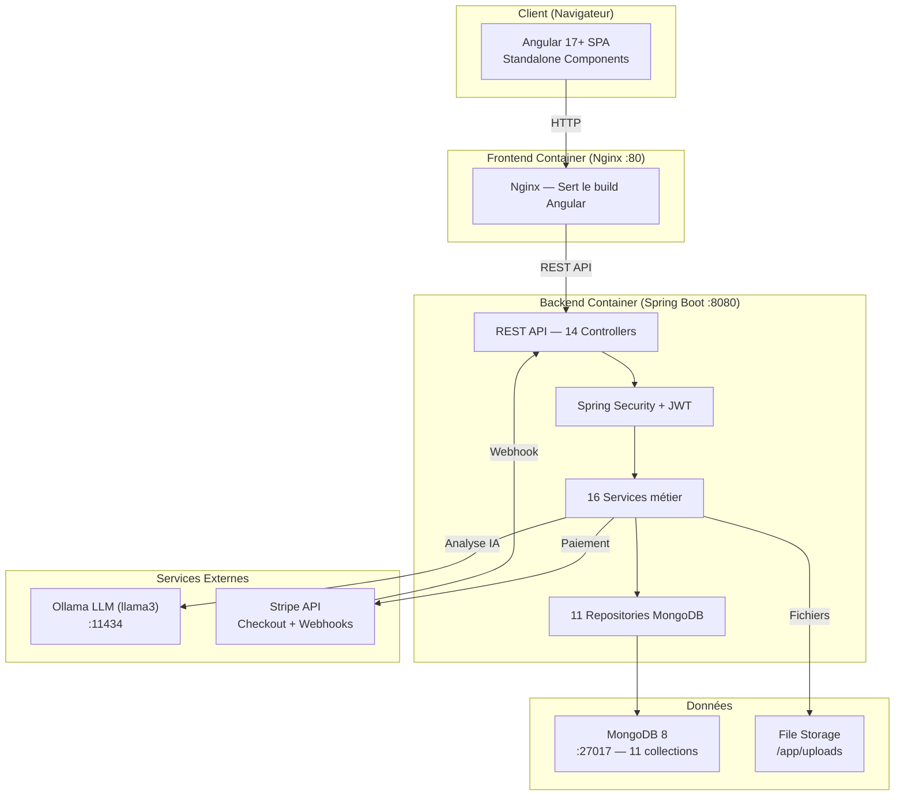

### 8.4 Workflow Sinistre — Cycle de Vie (Mermaid)

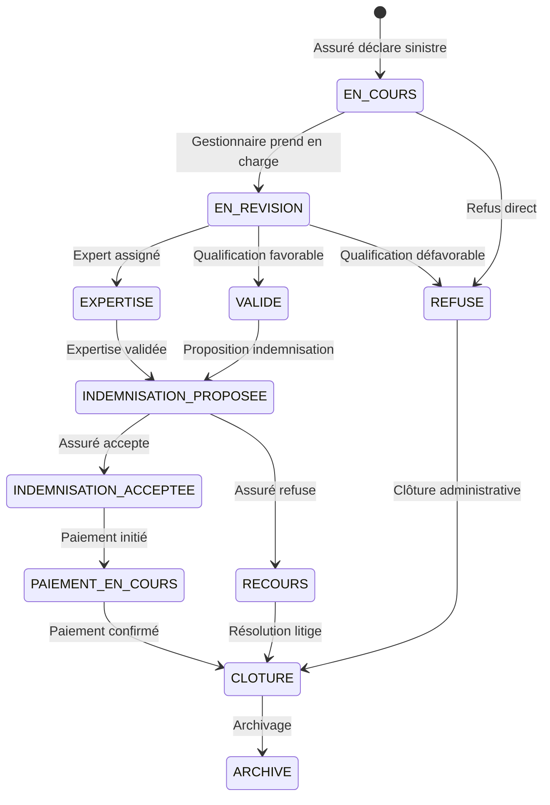

### 8.5 Workflow Remboursement (Mermaid)

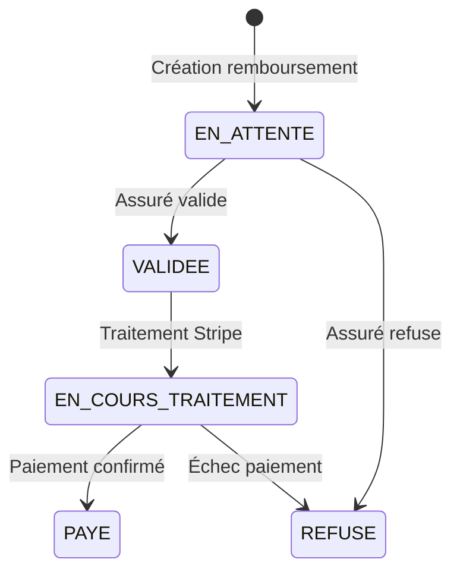

---

## 9. Diagrammes de Séquence par Sprint

### Sprint 1 — Authentification & Gestion des Utilisateurs

**Objectif**: Mise en place de l'authentification JWT, inscription, gestion des rôles et profils utilisateurs.

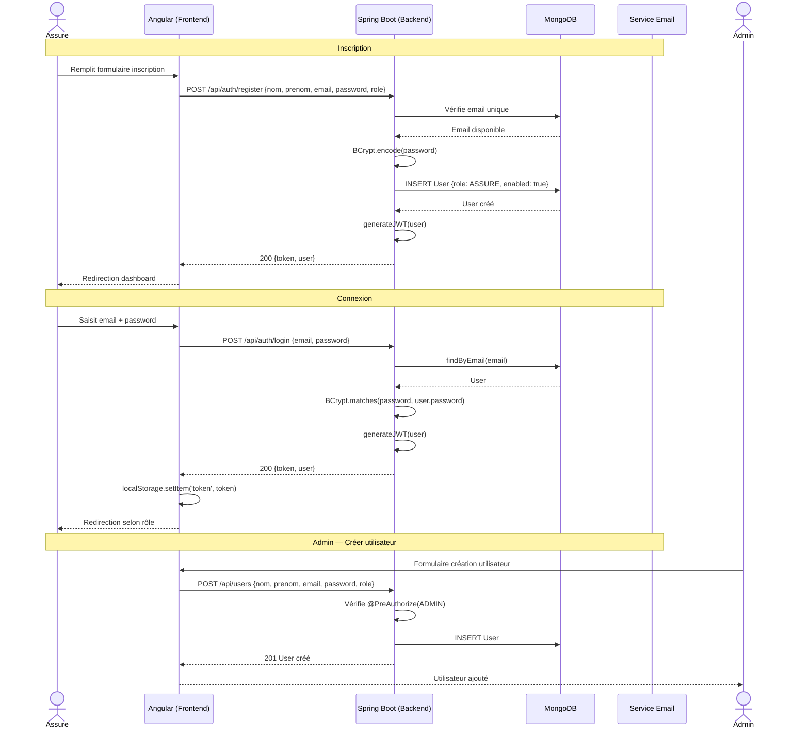

### Sprint 2 — Déclaration & Gestion des Sinistres

**Objectif**: Permettre aux assurés de déclarer des sinistres, aux gestionnaires de les qualifier et d'assigner des experts.

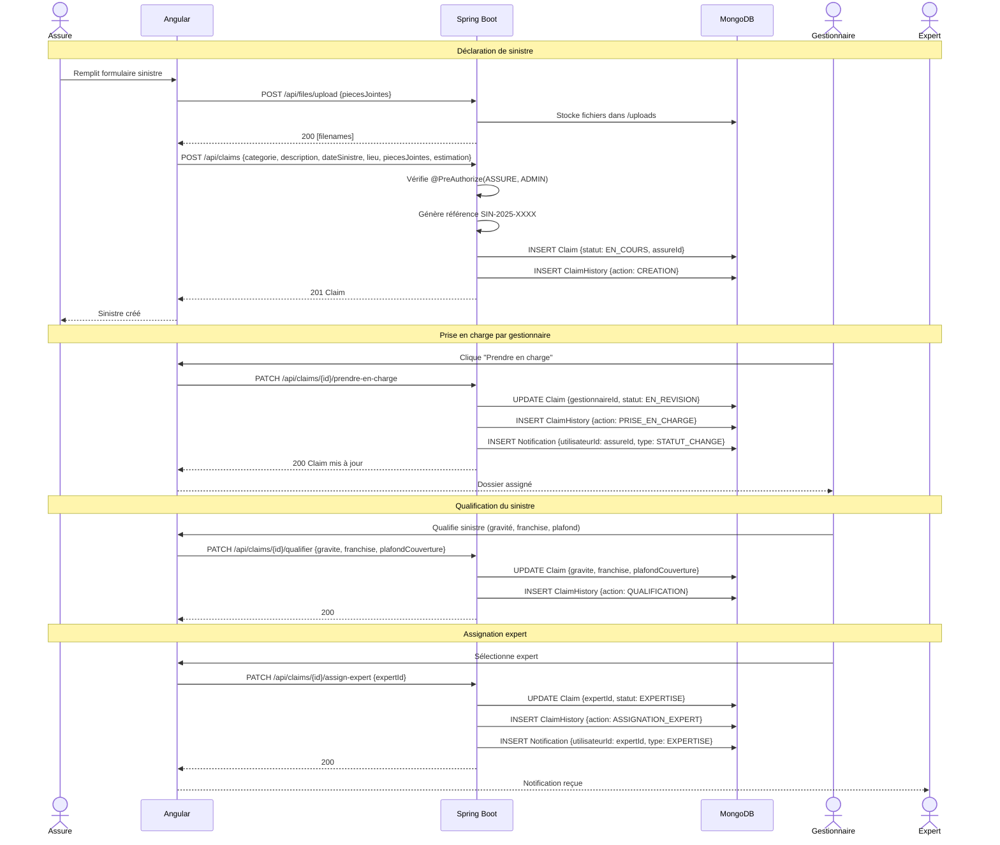

### Sprint 3 — Expertise & Analyse IA

**Objectif**: Intégrer l'analyse IA via Ollama et la gestion des rapports d'expertise.

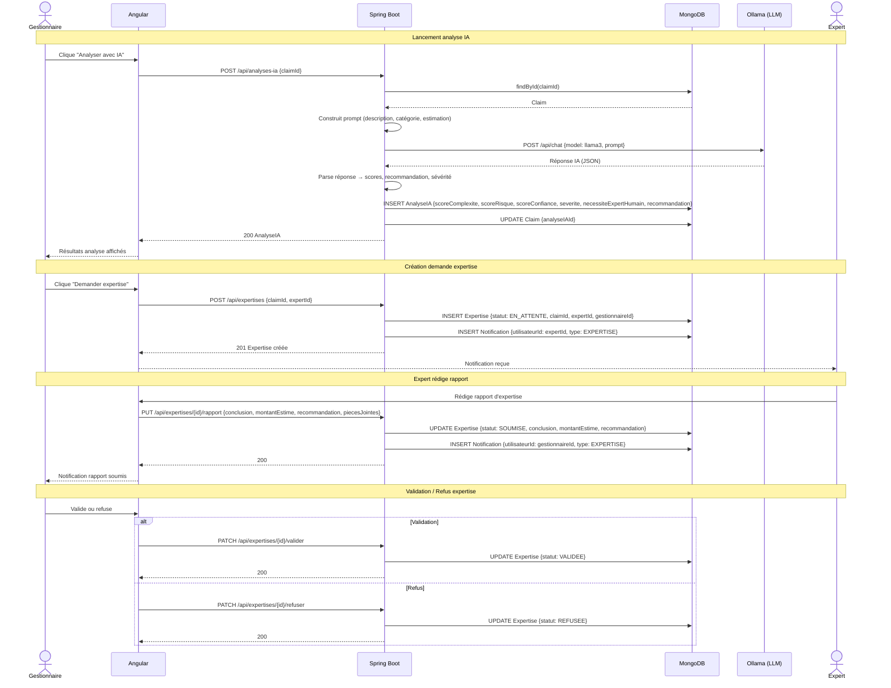

### Sprint 4 — Indemnisation & Remboursement (Stripe)

**Objectif**: Calcul d'indemnisation, proposition, validation par l'assuré, et paiement via Stripe.

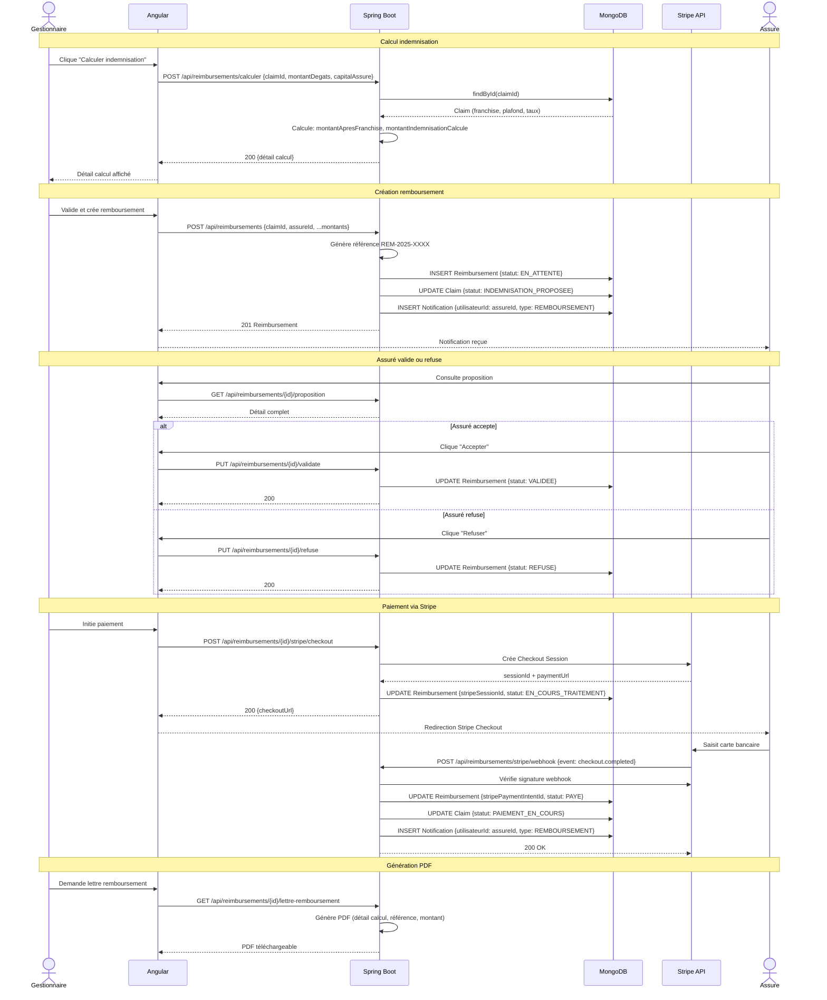

### Sprint 5 — Détection de Fraude & Messagerie

**Objectif**: Signalement de fraude, résolution admin, système de messagerie temps réel, notifications.

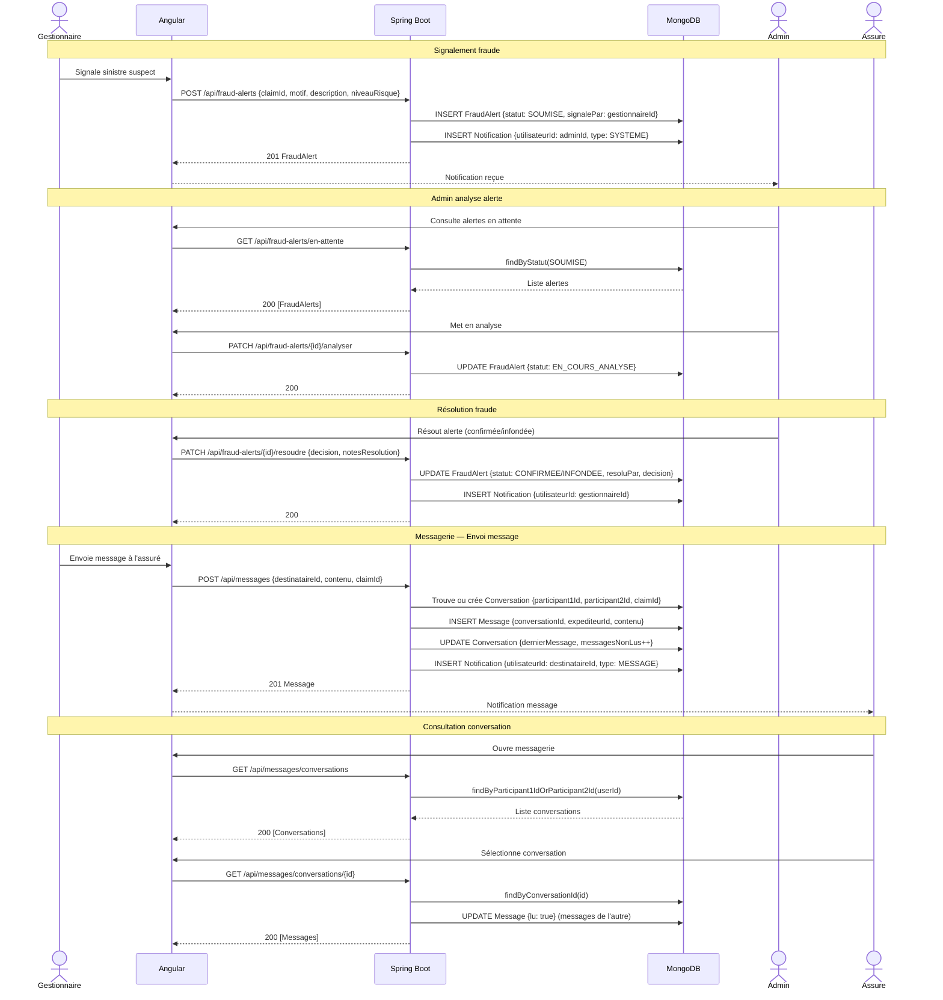

### Sprint 6 — Administration, Rapports & Support

**Objectif**: Dashboard admin, analytics, export CSV, tickets support, monitoring IA.

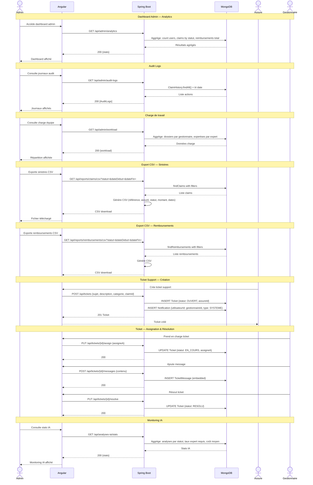

---

## 10. Architecture Détaillée du Système

### 10.1 Vue d'ensemble des couches

```mermaid
graph TB
    subgraph Navigateur ["🌐 Navigateur Client"]
        direction LR
        SPA["Angular 17+ SPA<br/>Standalone Components"]
        AUTH_GUARD["Auth Guard<br/>Route Protection"]
        HTTP_INT["HTTP Interceptor<br/>JWT Injection"]
        STATE["State Management<br/>Services + RxJS"]
    end

    subgraph Nginx ["🖥️ Nginx (Container :80)"]
        STATIC["Static Files<br/>dist/larchitecte-claims"]
        PROXY["Reverse Proxy<br/>/api → Backend"]
    end

    subgraph SpringBoot ["⚙️ Spring Boot (Container :8080)"]
        direction TB
        subgraph Security ["🔐 Security Layer"]
            JWT_FILTER["JwtAuthFilter<br/>Token Validation"]
            SECURITY_CTX["SecurityContext<br/>Authentication"]
            PRE_AUTH["@PreAuthorize<br/>Role-Based Access"]
        end

        subgraph Controllers ["📋 REST Controllers (14)"]
            AUTH_C["AuthController<br/>/api/auth"]
            CLAIM_C["ClaimController<br/>/api/claims"]
            EXPERT_C["ExpertiseController<br/>/api/expertises"]
            AI_C["AnalyseIAController<br/>/api/analyses-ia"]
            FRAUD_C["FraudAlertController<br/>/api/fraud-alerts"]
            REIMB_C["ReimbursementController<br/>/api/reimbursements"]
            MSG_C["MessageController<br/>/api/messages"]
            NOTIF_C["NotificationController<br/>/api/notifications"]
            TICKET_C["TicketController<br/>/api/tickets"]
            USER_C["UserController<br/>/api/users"]
            ADMIN_C["AdminController<br/>/api/admin"]
            FILE_C["FileController<br/>/api/files"]
            REPORT_C["ReportController<br/>/api/reports"]
            HIST_C["ClaimHistoryController<br/>/api/claims/{id}/history"]
        end

        subgraph Services ["🔧 Business Services (16)"]
            AUTH_S["AuthService<br/>JWT + BCrypt"]
            CLAIM_S["ClaimService<br/>Workflow Sinistre"]
            EXPERT_S["ExpertiseService<br/>Rapports"]
            AI_S["AnalyseIAService<br/>Ollama Integration"]
            FRAUD_S["FraudAlertService<br/>Détection Fraude"]
            REIMB_S["ReimbursementService<br/>Calcul Indemnisation"]
            STRIPE_S["StripeService<br/>Checkout + Webhooks"]
            PDF_S["PdfGenerationService<br/>Lettres PDF"]
            MSG_S["MessageService<br/>Messagerie"]
            NOTIF_S["NotificationService<br/>Notifications"]
            TICKET_S["TicketService<br/>Support"]
            USER_S["UserService<br/>CRUD Users"]
            ADMIN_S["AdminService<br/>Analytics"]
            FILE_S["FileStorageService<br/>Upload/Download"]
            HIST_S["ClaimHistoryService<br/>Audit Trail"]
            USERDET_S["CustomUserDetailsService<br/>Spring Security"]
        end

        subgraph Repos ["📦 Repositories (11)"]
            USER_R["UserRepository"]
            CLAIM_R["ClaimRepository"]
            EXPERT_R["ExpertiseRepository"]
            AI_R["AnalyseIARepository"]
            FRAUD_R["FraudAlertRepository"]
            REIMB_R["ReimbursementRepository"]
            CONV_R["ConversationRepository"]
            MSG_R["MessageRepository"]
            NOTIF_R["NotificationRepository"]
            TICKET_R["TicketRepository"]
            HIST_R["ClaimHistoryRepository"]
        end
    end

    subgraph Externals ["🔗 Services Externes"]
        OLLAMA["Ollama LLM<br/>llama3<br/>:11434"]
        STRIPE["Stripe API<br/>Checkout Sessions<br/>Payment Intents<br/>Webhooks"]
    end

    subgraph DataLayer ["💾 Couche Données"]
        MONGO["MongoDB 8<br/>:27017"]
        VOL["Docker Volume<br/>mongo-data"]
        UPLOADS["File Storage<br/>/app/uploads"]
        UP_VOL["Docker Volume<br/>uploads-data"]
    end

    SPA --> AUTH_GUARD
    SPA --> HTTP_INT
    SPA --> STATE
    SPA -->|HTTP Requests| Nginx
    Nginx --> STATIC
    Nginx -->|/api/*| SpringBoot

    JWT_FILTER --> SECURITY_CTX
    SECURITY_CTX --> PRE_AUTH
    PRE_AUTH --> Controllers

    Controllers --> Services
    Services --> Repos
    Repos --> MONGO
    MONGO --> VOL

    AI_S -->|HTTP| OLLAMA
    STRIPE_S -->|HTTP| STRIPE
    STRIPE -->|Webhook POST| REIMB_C
    FILE_S --> UPLOADS
    UPLOADS --> UP_VOL

    style Navigateur fill:#e3f2fd
    style Nginx fill:#e8f5e9
    style Security fill:#ffebee
    style Controllers fill:#fff3e0
    style Services fill:#f3e5f5
    style Repos fill:#e0f2f1
    style Externals fill:#fce4ec
    style DataLayer fill:#efebe9
```

### 10.2 Flux d'Authentification JWT

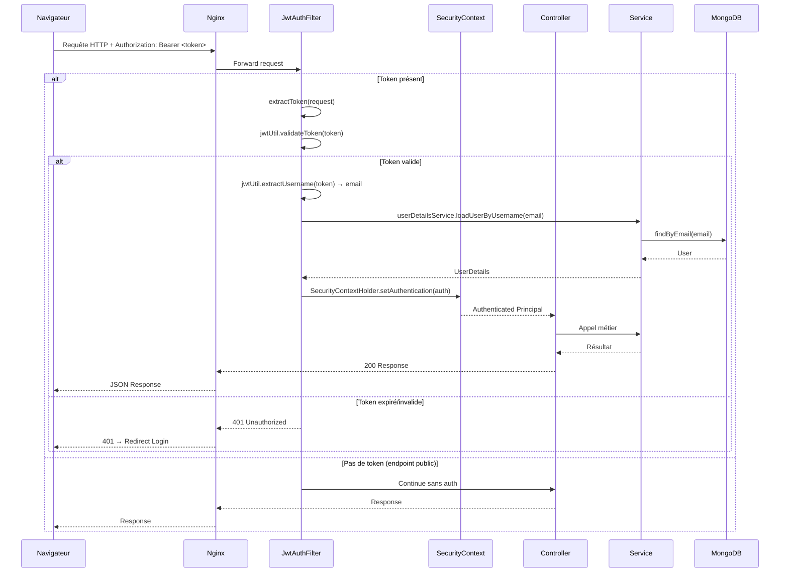

### 10.3 Architecture Docker — Déploiement

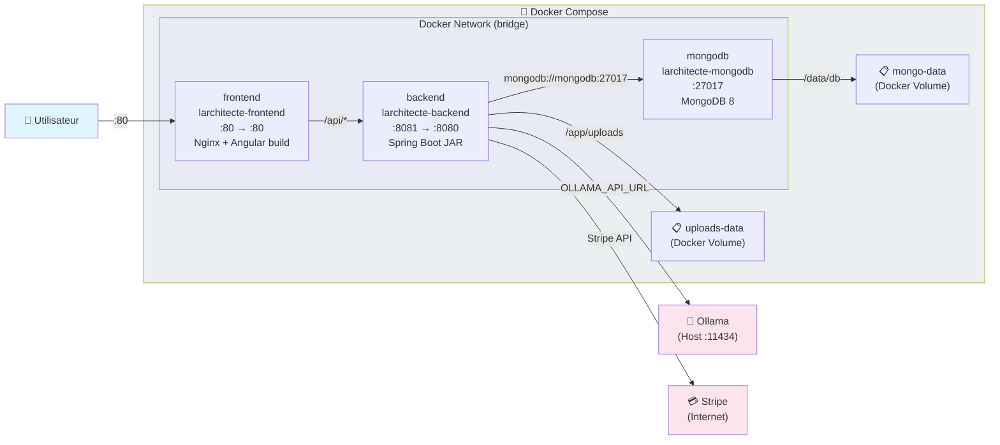

### 10.4 Matrice des Rôles par Fonctionnalité

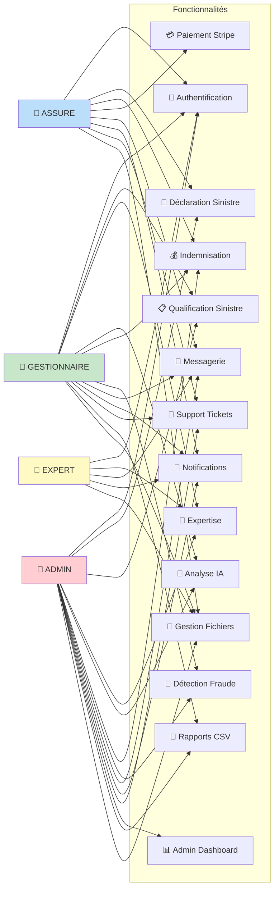

---

## 11. Conteneurisation Docker

### 11.1 Vue d'ensemble

L'application est entièrement conteneurisée via **Docker Compose** avec 3 services :

| Service | Image de base | Port (hôte→conteneur) | Rôle |
|---------|---------------|----------------------|------|
| `mongodb` | mongo:8 | 27017:27017 | Base de données NoSQL |
| `backend` | Multi-stage (maven + JRE alpine) | 8081:8080 | API Spring Boot |
| `frontend` | Multi-stage (node + nginx alpine) | 80:80 | SPA Angular + Reverse Proxy |

### 11.2 docker-compose.yml

```yaml
services:
  # ---- MongoDB ----
  mongodb:
    image: mongo:8
    container_name: larchitecte-mongodb
    ports:
      - "27017:27017"
    volumes:
      - mongo-data:/data/db
    restart: unless-stopped

  # ---- Backend (Spring Boot) ----
  backend:
    build:
      context: ./backend
      dockerfile: Dockerfile
    container_name: larchitecte-backend
    ports:
      - "8081:8080"
    environment:
      - MONGODB_URI=mongodb://mongodb:27017/larchitecte_claims
      - OLLAMA_API_URL=http://host.docker.internal:11434/api/chat
      - FRONTEND_URL=http://localhost
    volumes:
      - uploads-data:/app/uploads
    depends_on:
      - mongodb
    restart: unless-stopped

  # ---- Frontend (Angular + Nginx) ----
  frontend:
    build:
      context: ./front/larchitecte-claims
      dockerfile: Dockerfile
    container_name: larchitecte-frontend
    ports:
      - "80:80"
    depends_on:
      - backend
    restart: unless-stopped

volumes:
  mongo-data:
  uploads-data:
```

### 11.3 Dockerfiles

#### Backend — Multi-stage (Build + Runtime)

```dockerfile
# ---- Build stage ----
FROM maven:3.9-eclipse-temurin-21 AS build
WORKDIR /app
COPY pom.xml .
RUN mvn dependency:go-offline -B    # Cache dépendances
COPY src ./src
RUN mvn package -DskipTests -B      # Compilation + packaging JAR

# ---- Runtime stage ----
FROM eclipse-temurin:21-jre-alpine   # Image légère JRE only
WORKDIR /app
RUN mkdir -p /app/uploads            # Répertoire upload
COPY --from=build /app/target/*.jar app.jar
EXPOSE 8080
ENTRYPOINT ["java", "-jar", "app.jar"]
```

| Étape | Image | Description |
|-------|-------|-------------|
| Build | maven:3.9-eclipse-temurin-21 | Compilation Maven, résolution dépendances, package JAR |
| Runtime | eclipse-temurin:21-jre-alpine | Exécution légère (~170MB), JRE uniquement |

#### Frontend — Multi-stage (Build + Nginx)

```dockerfile
# ---- Build stage ----
FROM node:22-alpine AS build
WORKDIR /app
COPY package.json package-lock.json ./
RUN npm install                      # Cache node_modules
COPY . .
RUN npm run build                    # ng build → dist/

# ---- Runtime stage ----
FROM nginx:alpine
COPY --from=build /app/dist/larchitecte-claims/browser /usr/share/nginx/html
COPY nginx.conf /etc/nginx/conf.d/default.conf
EXPOSE 80
CMD ["nginx", "-g", "daemon off;"]
```

| Étape | Image | Description |
|-------|-------|-------------|
| Build | node:22-alpine | npm install + ng build (SSR/browser output) |
| Runtime | nginx:alpine | Sert les fichiers statiques + reverse proxy /api/ |

### 11.4 Configuration Nginx (Reverse Proxy)

```nginx
server {
    listen 80;
    server_name localhost;
    root /usr/share/nginx/html;
    index index.html;

    # API requests -> backend
    location /api/ {
        proxy_pass http://backend:8080/api/;
        proxy_set_header Host $host;
        proxy_set_header X-Real-IP $remote_addr;
        proxy_set_header X-Forwarded-For $proxy_add_x_forwarded_for;
        proxy_set_header X-Forwarded-Proto $scheme;
        proxy_read_timeout 300s;
        proxy_connect_timeout 75s;
    }

    # Angular SPA fallback (client-side routing)
    location / {
        try_files $uri $uri/ /index.html;
    }
}
```

| Directive | Rôle |
|-----------|------|
| `location /api/` | Proxy inverse vers le backend Spring Boot |
| `proxy_pass http://backend:8080` | Résolution DNS Docker (nom du service) |
| `proxy_read_timeout 300s` | Timeout long pour les analyses IA |
| `try_files $uri $uri/ /index.html` | Fallback SPA — toutes les routes Angular |

### 11.5 Variables d'Environnement

| Variable | Service | Valeur par défaut | Description |
|----------|---------|-------------------|-------------|
| `MONGODB_URI` | backend | mongodb://localhost:27017/larchitecte_claims | URI connexion MongoDB |
| `OLLAMA_API_URL` | backend | http://localhost:11434/api/chat | URL API Ollama (LLM) |
| `FRONTEND_URL` | backend | http://localhost:4200 | URL frontend (CORS) |
| `server.port` | backend | 8080 | Port interne Spring Boot |
| `jwt.secret` | backend | Base64 encoded key | Clé secrète JWT |
| `jwt.expiration` | backend | 86400000 (24h) | Durée validité JWT |
| `stripe.secret-key` | backend | sk_test_... | Clé secrète Stripe |
| `stripe.webhook-secret` | backend | whsec_... | Secret webhook Stripe |
| `ollama.model` | backend | llama3 | Modèle LLM utilisé |
| `ollama.temperature` | backend | 0.3 | Température génération |
| `ollama.max-tokens` | backend | 2000 | Max tokens par analyse |

### 11.6 Volumes Docker

| Volume | Point de montage | Utilisation |
|--------|-----------------|-------------|
| `mongo-data` | /data/db (mongodb) | Persistance des données MongoDB |
| `uploads-data` | /app/uploads (backend) | Fichiers uploadés (pièces jointes) |

### 11.7 Réseau & Communication Inter-Containers

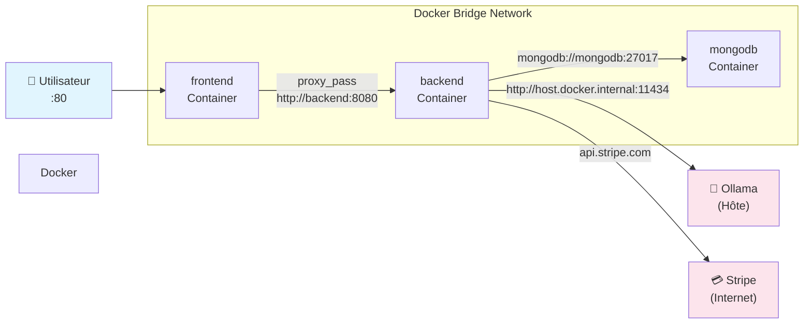

- **Frontend → Backend**: Nginx proxy via nom DNS Docker `backend:8080`
- **Backend → MongoDB**: Connexion via nom DNS Docker `mongodb:27017`
- **Backend → Ollama**: Via `host.docker.internal` (accès hôte depuis container)
- **Stripe → Backend**: Webhook vers URL publique (nécessite ngrok/tunnel en dev)

### 11.8 Commandes Docker

```bash
# Build et démarrage (tous les services)
docker-compose up --build -d

# Voir les logs
docker-compose logs -f backend
docker-compose logs -f frontend

# Arrêter les services
docker-compose down

# Arrêter + supprimer les volumes (reset données)
docker-compose down -v

# Rebuild un seul service
docker-compose up --build -d backend

# Accéder au shell d'un container
docker exec -it larchitecte-backend sh
docker exec -it larchitecte-mongodb mongosh

# Vérifier l'état des services
docker-compose ps
```

### 11.9 .dockerignore

**Backend** (`backend/.dockerignore`):
```
target/
!.mvn/wrapper/maven-wrapper.jar
*.class
*.log
*.jar
!pom.xml
```

**Frontend** (`front/larchitecte-claims/.dockerignore`):
```
node_modules/
dist/
.angular/
.git/
```

### 11.10 Diagramme Pipeline CI/CD Docker

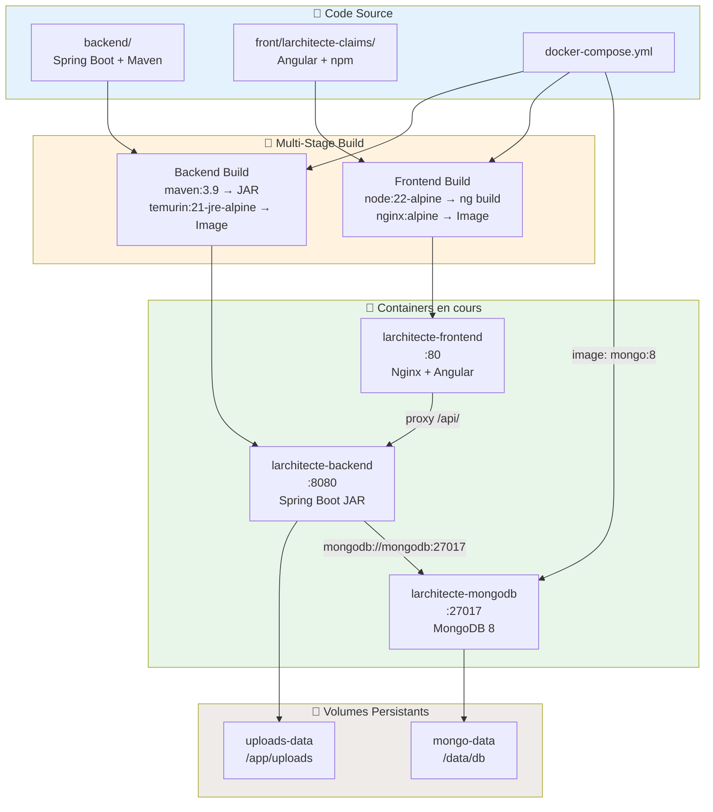
